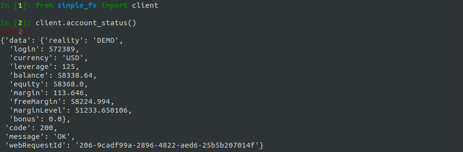

### SimpleFX REST API

This is a python wrapper to connect to SimpleFX's REST API

#### Table of Contents

1. [Installation](#installation)
2. [Credentials](#credentials)
3. [List Instruments](#list_instruments)
4. [Symbol Infomation](#symbol_info)
5. [Accounts Overview](#accounts_overview)
6. [Account Status](#account_status)
7. [Market Order](#market_order)
8. [Pending Order](#pending_order)
9. [Adjust Pending Order](#adjust_pending_order)
10. [Adjust Take Profit Order](#adjust_take_profit_order)
11. [Adjust Stop Loss Order](#adjust_stop_loss_order)
12. [Delete Pending Order](#delete_pending_order)
13. [Close Position](#close_position)
14. [Get Positions / Pending Orders](#get_positions_pending_orders)

<a name="installation"/>

#### 1. Installation Ubuntu

```shell
mkdir SimpleFX && cd SimpleFX

git clone https://github.com/Jimmy-sha256/SimpleFX_REST_API.git 
```

<a name="credentials"/>

#### 2. Credentials

Add your SimpleFX api access key and access secret to the credentials.py file:
* https://app.simplefx.com/api-client

Add either 'DEMO' or 'LIVE' to the credentials.py file


<a name="list_instruments"/>

#### 3. List Instrumnets

Get a list of available instrumnets

```python
client.list_instrumets()
```


<a name="symbol_info"/>

#### 4. Symbol Information

```python
client.symbol_info('symbol')
```

| Paramaters | Type     | Description        |
|------------|----------|--------------------|
| symbol   | string | `'BTCUSD'` , `'DJI30'` |


<a name="accounts_overview"/>

#### 5. Account Overview

Retrieve status of all accounts

```python
client.accounts_overview()
```


<a name="account_status"/>

#### 6. Account Status

Retrieve account status

```python
client.account_status()
```



<a name="market_order"/>

#### 7. Market Order

```python
client.market_order('symbol', 'side', vol, tp, sl)
```

| Paramaters | Type     | Description        |
|------------|----------|--------------------|
| `symbol`   | `string` | `BTCUSD` , `DJI30` |
| `side`     | `string` | `BUY`, `SELL`      |
| `vol` | `int` | number of units to purchase |
| `tp` | `int` | take profit price |
| `sl` | `int` | stop loss price |


<a name="pending_order"/>

#### 8. Pending Order

```python
client.pending_order('symbol', 'side', price, vol, tp, sl)
```

| Paramaters | Type     | Description                 |
|------------|----------|-----------------------------|
| `symbol`   | `string` | `BTCUSD` , `DJI30`          |
| `side`     | `string` | `BUY`, `SELL`               |
| `price`    | `int`    | price to purchase units     |
| `vol`      | `int`    | number of units to purchase |
| `tp`       | `int`    | take profit price           |
| `sl`       | `int`    | stop loss price             |


<a name="adjust_pending_order"/>

#### 9. Adjust Pending Order

```python
client.adjust_order(order_id, price, vol, tp, sl)
```

| Paramaters | Type  | Description                 |
|------------|-------|-----------------------------|
| `order_id` | `int` | order id number             |
| `price`    | `int` | price to purchase units     |
| `vol`      | `int` | number of units to purchase |
| `tp`       | `int` | take profit price           |
| `sl`       | `int` | stop loss price             |


<a name="adjust_take_profit_order"/>

#### 10. Adjust Take Profit 

Add or adjust the take profit order of an open position.

```python
client.adjust_tp(order_id, tp)
```

| Paramaters | Type  | Description       |
|------------|-------|-------------------|
| `order_id` | `int` | order id number   |
| `tp`       | `int` | take profit price |


<a name="adjust_stop_loss_order"/>

#### 11. Adjust Stop Loss

Add or adjust the stop loss order of an open postion.

```python
client.adjust_sl(order_id, sl)
```

| Paramaters | Type  | Description       |
|------------|-------|-------------------|
| `order_id` | `int` | order id number   |
| `sl`       | `int` | stop losstake price |


<a name="delete_pending_order"/>

#### 12. Delete Pending Order

```python
client.delete_order(order_id)
```

| Paramaters | Type  | Description       |
|------------|-------|-------------------|
| `order_id` | `int` | order id number   |


<a name="close_postion"/>

#### 13. Close Position

Close a partial or full position

```python
client.close_position(order_id, vol)
```

| Paramaters | Type  | Description              |
|------------|-------|--------------------------|
| `order_id` | `int` | order id number          |
| `vol`      | `int` | number of units to close |


<a name="get_positions_pending_orders"/>

#### 14. Get Postions / Pending Orders

```python
client.get_postions()
```


